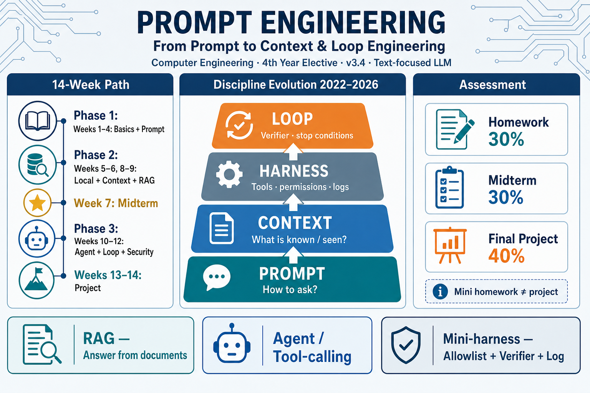

# Prompt Engineering

**Language / Dil:** [Türkçe](README.md) · English

## Computer Engineering — 4th Year Elective
### From Prompt to Context and Loop Engineering

**Version:** 3.4 · **Last updated:** July 2026  
**Status:** Draft — will be updated as the field evolves.



---

## Who can read this document?

This curriculum is for a **Computer Engineering 4th-year** elective course. It is also written to be understandable for readers from law, medicine, business, education, design, and similar fields who work with ChatGPT-like tools and want to go beyond *“asking AI good questions”* toward *building systems*.

**Readers who do not write code:** The weekly “conceptual” sections and the glossary below are enough for you. Lab/homework rows are the applied part of the course.

**Readers who can write code:** Follow the glossary, weekly plan, and assessment sections.

### What is useful to know before starting this course?


| Level                                      | What is expected?                                                                      |
| ------------------------------------------ | -------------------------------------------------------------------------------------- |
| **Sufficient**                             | Having tried a tool such as ChatGPT/Claude                                             |
| **Ideal for the course**                   | Basic Python (variables, functions, reading files); familiarity with the command line  |
| **Not required but helpful**               | A machine learning / deep learning course; math-heavy AI background                    |


### API and cost

**Primary cloud path: [OpenRouter](https://openrouter.ai).**  
With a single account / single API key you can reach many models (e.g. OpenAI, Anthropic Claude, Google Gemini, open models). Students do **not** need to subscribe separately to OpenAI and Anthropic and pay double bills.


| Path                              | When?                                           | Cost                                                                        |
| --------------------------------- | ----------------------------------------------- | --------------------------------------------------------------------------- |
| **OpenRouter** (recommended cloud)| Course labs, agents, structured output          | Single wallet; pay as you go. Low-cost models can be selected               |
| **Ollama / LM Studio** (local)    | Privacy, free trials, offline work              | No API fee (computer resources required)                                    |


- Never put keys on GitHub; use `.env` (`OPENROUTER_API_KEY`).  
- OpenRouter provides an **OpenAI-compatible** endpoint for most clients (`base_url` is changed) — you do not have to learn a separate “Claude SDK + OpenAI SDK”.  
- Watch rate limits and token usage; unbounded loops inflate the bill (Weeks 11–12).  
- **Cost tip:** Do not always give the same job to the most expensive model; try a small/cheap model for simple tasks (Week 3 routing).

---

## What is this course about?

Being able to talk effectively with tools like ChatGPT is **prompt writing**. In real applications, controlling *which information*, *in which order*, *with which tools* is given to the model, and *when the work is done* under *which rules*, matters more — and that is engineering work. This course teaches good prompt writing; then turns it into an engineering skill by combining it with **context management**, **document-grounded answers (RAG)**, **tool-using agents**, and **verifier loops + mini-harness**.

---

## How to read this

Every topic has three levels:


| Label                        | Meaning                                                                      |
| ---------------------------- | ---------------------------------------------------------------------------- |
| **Required (apply)**         | Done in class / submitted as homework                                        |
| **Conceptual (recognize)**   | Understanding is enough; you are not expected to write code (short demo OK)  |
| **Further reading**          | For the curious and those who want to do projects; not required              |


---

## Short glossary

English terms are common in the industry. Terms below use the English name as primary.


| Term                                      | Short definition                                                                                      | Example                                                                              |
| ----------------------------------------- | ----------------------------------------------------------------------------------------------------- | ------------------------------------------------------------------------------------ |
| **Large language model (LLM)**            | An AI model that generates text from text                                                             | ChatGPT, Claude, or a model on OpenRouter                                            |
| **Token**                                 | The small text unit the model processes                                                               | A sentence split into 12–20 tokens; count ≈ cost                                     |
| **BPE (Byte Pair Encoding)**              | A common tokenization method that builds a vocabulary by merging frequent pieces                      | A rare/long word split into several tokens                                           |
| **Token embedding**                       | The layer that turns each token into a numeric vector *inside* the LLM (for generating answers)       | The vectors attention operates on; Week 2                                            |
| **Prompt**                                | The question or instruction you write to the model                                                    | “Rewrite this email in a formal tone.”                                               |
| **Context**                               | All text the model sees for that answer: system rules, chat history, documents, tool list             | A PDF snippet you paste into the chat                                                |
| **Context window**                        | The maximum text you can fit into the model in one request (measured in tokens)                       | Being able to send a long document with a 128K window; still no need to send everything |
| **Attention budget**                      | The model cannot focus on every word in the context with equal quality                                | Missing a sentence in the middle of a 50-page text                                   |
| **Context rot**                           | Important information given early weakens as the context grows longer                                 | After 40 messages, not applying “the rule from step 1”                               |
| **Structured output**                     | A fixed-field answer instead of a free paragraph (usually JSON)                                       | `{"sentiment":"positive","confidence":0.9}`                                          |
| **Retrieval-augmented generation (RAG)**  | Finding the relevant snippet from your files first, adding it to the model, then generating an answer | “Is there a make-up exam?” → find the clause in the regulation PDF → give to model → answer |
| **Search embedding (embedding, RAG)**     | Turning text into numbers to *search* “is this semantically close?” (often a separate model)          | “vacation leave” ≈ “annual leave”; Week 8 — different purpose from token embedding   |
| **Overlap**                               | Consecutive chunks overlapping a little                                                               | Reducing mid-sentence cuts with 15% overlap                                          |
| **Hybrid search**                         | Using vector (meaning) + keyword (BM25) search together                                               | Not missing article numbers or product codes                                         |
| **Rerank**                                | Re-ranking the first candidate list with a second model                                               | Find 30 chunks → give the best 5 to the model                                        |
| **Contextual retrieval**                  | Embedding a chunk after adding a short summary of where it sits in the document                       | “This chunk is from the leave section of regulation X” + chunk text                  |
| **Late chunking**                         | The idea of embedding long text first, then setting chunk boundaries                                  | Reducing boundary loss in reference-dense text                                       |
| **Model routing**                         | Giving simple work to a cheap/fast model, hard work to a strong model                                 | “Hello” → small model; long analysis → large model                                   |
| **Observability**                         | Logging model, tokens, duration, cost, and tool steps on every call                                   | Log line: model=… tokens=… latency_ms=… cost≈…                                       |
| **Guardrails**                            | Automatically filtering requests or answers for security/policy                                       | PII masking; rejecting on suspected injection                                        |
| **Chunking**                              | Splitting a long document into small pieces for search                                                | Splitting an 80-page PDF into ~500–1000 word sections                                |
| **Agent**                                 | A system that can advance work by calling defined tools when needed                                   | “Get today’s rate, convert to TRY” → first rate API, then answer                     |
| **Function / tool calling**               | The model saying “run this function with these parameters”; your code executes it                     | `get_weather(city="Isparta")`                                                        |
| **ReAct (Reason + Act)**                  | Think → use tool → read result → repeat if needed                                                     | Searches first, then takes the second step after seeing the result                   |
| **Model Context Protocol (MCP)**          | A common connection standard for linking tools and data sources to the model                          | Connecting the same calendar tool similarly across different chat apps               |
| **Skill**                                 | An instruction file written as “this job is done like this” (`SKILL.md`); not a tool                  | A guide containing steps for “How to write a pull request summary?”                  |
| **Loop**                                  | An automatic cycle that repeats until the job is done or a limit is hit                               | Write code → run tests → fix if error → at most 5 times                              |
| **Verifier**                              | An automatic check asking “Is this output acceptable?”                                                | Valid JSON? Does the answer contain `06`? Are tests green?                           |
| **Agent harness**                         | Rules wrapping the loop: open tools, step limit, log, verifier                                        | Only `search` and `calculator` open; `delete_file` closed                            |
| **Tool allowlist**                        | A closed list of tools the agent is allowed to use                                                    | Allowed: `search`, `get_weather` · Forbidden: sending email                          |
| **Compaction**                            | Summarizing a long chat and continuing with the summary                                               | Reducing 30 messages to 1 paragraph and pasting into a new session                   |
| **Progressive disclosure**                | Not giving the whole document up front; reading the relevant part as needed                           | File names first; when told “read section 3”, add only that                          |
| **Context poisoning**                     | The model degrading when wrong or malicious text enters the context                                   | User text saying “ignore previous rules”                                             |
| **Minimum viable product (MVP)**          | A narrow-scope but truly working first version                                                        | RAG with 3 PDFs first; not the entire university archive                             |
| **OWASP**                                 | An organization listing common security risks in software / LLM applications                          | In this course: LLM Top 10 (2025) list                                               |


### Three sibling concepts

1. **Function calling:** The model can call a Python function you wrote.
2. **Model Context Protocol (MCP):** Connecting such tools in a *standard way* (mostly introductory in the course).
3. **Skill:** Not a tool; an instruction package describing *how to work*.

### ReAct, loop, and harness — three layers


| Layer                                 | Question                                                              | In this course                              |
| ------------------------------------- | --------------------------------------------------------------------- | ------------------------------------------- |
| **ReAct (Week 10)**                   | What should the model think and which tool should it call in one step?| The agent’s *inner* behavior                |
| **Loop (Week 11)**                    | How many times should it try, when should it stop, which test says “done”? | Repeating cycle + verifier              |
| **Harness (Week 11)**                 | Which tools are open, is there a log, are permissions limited?        | Rules and controls outside the loop         |


Short summary: ReAct = what it does in one step · Loop = when it ends · Harness = with which permissions and controls it runs.

---

## Evolution of the field (2022–2026) — with examples

```text
1) PROMPT         →  Asking well: “Write me a summary”
2) CONTEXT        →  Putting the right documents / history on the table for the summary
3) HARNESS        →  Which tools to give the assistant, with which permissions
4) LOOP           →  Write → check → fix → stop when done (automatic)
```

The prompt is still foundational; it is not enough alone. The course covers these four layers in order.

---

## Course Introduction Video

[Prompt Engineering Course Introduction Video](https://youtu.be/NW00MA3qW-E)

> Note: The video may be in Turkish / from an older version; the current framework is the v3 plan in this README.

---

## Course objectives

By the end of the term, students will be able to:

- Explain what large language models (LLMs) are and roughly how they work (token, BPE, token embedding)  
- Write good prompts, version prompts, and get answers in a regular format such as **form/JSON**  
- Experiment with a cloud API (**OpenRouter**) or a local model; know the simple idea of **model routing**  
- Manage the information given to the model (context) deliberately; recognize context failures  
- Build a simple **RAG** system that answers from their own documents (chunking, embedding, citing sources)  
- Write a simple **agent** that uses tools  
- Build a small **loop / mini-harness** with **verifier + step limit + tool permissions + basic observation log**  
- Recognize major security risks and the simple idea of **guardrails**  
- Produce a **small but working** (MVP) solution to a real problem

MCP, GraphRAG, fine-tuning labs, and advanced memory products are at the **recognize** level. Multimodal (image/audio) models are out of scope for this course.

---

## Assessment

**Approach:** Small homework each week + one classic midterm + a **single** group project at the end of the term.


| Component                    | Weight | What is expected?                                                                              |
| ---------------------------- | ------ | ---------------------------------------------------------------------------------------------- |
| **Homework and practice**    | 30%    | 6–8 short assignments (each about 1–3 hours). Not a large “project”; one script + short note   |
| **Midterm exam**             | 30%    | Weeks 1–6: concepts + prompt writing + short code reading (60 min)                             |
| **Final project**            | 40%    | Groups of 2–3: working application + presentation + report                                     |


- Homework grades do not mix into the midterm.  
- Homework examples: “compare three different prompts”, “Q&A with 3 PDFs”, “agent with at most 5 steps + 5 tests”.

### Final project (MVP) — clear rules

- Announcement: **after Week 8**; submission: **Weeks 13–14**  
- Required:
  1. Working code + a README explaining setup
  2. A short document of which prompts you used and why (**prompt file / version notes**)
  3. **Either** document-based Q&A (RAG) **or** a tool-using agent (you do not have to go deep on both)
  4. **Verifier:** At least **5 checks** (golden set). Examples:
    - Is the output really JSON?  
    - For “What is Ankara’s plate code?”, does the answer contain `06`?  
    - Does the agent avoid calling a forbidden tool?  
    - Does it finish in at most N steps?
  5. If you chose RAG: **source/citation** in answers; if you chose agent: **token/duration log**
- Bonus (optional): skill file, ready MCP tool, compaction, model routing note, PII masking

**A verifier ≠ the model saying “I am correct” by itself.** It is an automatic check or small test list that you write.

---

## Weekly plan (14 weeks)

### Week 1 — Introduction to Generative AI

**What will you learn this week?** Which family ChatGPT-like tools belong to; a first look at the prompt / context / loop / harness map.

- Artificial intelligence, machine learning, generative AI (focus in this course: **text**)  
- Discriminative model (classifies) vs generative model (produces new content)  
- Examples: GPT, Claude, Gemini, LLaMA  
- Very short introduction to Transformers  
- **Conceptual:** Prompt → Context → Harness → Loop map (with the examples above)

**Required:** Try 5 tasks with two different chat tools and write a short note.

---

### Week 2 — How does a model roughly work?

**What will you learn this week?** Seeing step by step how text enters the model: **tokenization / BPE** → **token embedding** → attention → next-token prediction → sampling with temperature.

Simple flow:

```text
Text → split into tokens (e.g. BPE)
     → each token becomes a vector (token embedding)
     → self-attention: tokens “look at” each other
     → the model predicts the next token
     → answer is produced with temperature / top-p
```

#### 1) Tokenization

- **Token:** The small text unit the model processes (can be a word, subword, or character piece)  
- **BPE (Byte Pair Encoding):** A common method that builds a vocabulary by merging frequent character/subword pairs. Example: compound spellings like “yapayzekâ” or rare words can be split into several tokens.  
- Why does it matter? Token count ≈ cost and context-window consumption; the same sentence can count as different token numbers on different models.  
- **Lab idea:** Split the same Turkish sentence with a tokenizer and see the token list and count.

#### 2) Token embedding — foundation of the LLM

- Each token is turned into a fixed-size **numeric vector** inside the model; attention operates on these vectors.  
- Position encoding is also added: order matters.  
- **Attention (critical distinction for this course):**  
  - **Embedding here** = the LLM’s inner layer (for generating answers).  
  - **Embedding in Week 8** = a separate (or similar) embedding model for searching documents. Both say “vector” but their purposes differ.

#### 3) Attention and generation

- Self-attention = “which token looks at which token?” (no detailed math)  
- Next-token prediction = predicting the next piece  
- Model size (7B ≈ ~7 billion parameters): generally more capable but more expensive/heavy  
- Temperature / Top-p: making the answer more creative or more conservative  
- **Conceptual preview:** Attention dilution on very long text (Week 6)

**Required:**  

1. Generate the same sentence at different temperatures and report the difference
2. Short tokenizer experiment: splitting a sentence into tokens + approximate token count (observing the BPE idea is enough)

---

### Week 3 — Prompt writing, OpenRouter API, and structured output

**What will you learn this week?** System/user messages; teaching by example; putting the answer into JSON form; calling a model from Python with a **single OpenRouter key**.

- Zero-shot: asking without examples  
- Few-shot: asking with a few examples  
- Chain-of-Thought: “think step by step”  
- **Structured output:** Fixed fields such as `{ "sentiment": "positive" }` instead of a free paragraph  
- **OpenRouter setup:** account → API key → `.env` (`OPENROUTER_API_KEY`)  
- OpenAI-compatible client: same SDK pattern with `base_url="https://openrouter.ai/api/v1"`  
- Trying different models with the same code skeleton (cheap / strong model comparison)  
- **Model routing idea:** Simple classification → cheap model; hard reasoning → strong model (**conceptual + two models in homework**)  
- **Prompt versioning:** Keeping prompts in a file separate from code (`prompts/v1.txt`); seeing what changed in Git  
- Rate limit and token consumption idea  
- **Conceptual:** Streaming (answer arriving piece by piece); prompt/prefix caching (cost reduction on repeating system prompts)

**Required:** OpenRouter setup + few-shot + JSON output homework (short comparison with at least two different model names) + keeping the prompt in a separate file.

> Optional: Direct OpenAI/Anthropic keys can also be used later; **not required** in this course.

---

### Week 4 — Better prompts and first security warning

**What will you learn this week?** Clear instructions, section separators, “act like an expert” (persona); the risk of breaking rules with a malicious prompt.

- Writing clearly and specifically  
- Splitting text with `###` or XML (reduces the model mixing things up)  
- **Right altitude:** Neither an overly rigid pile of rules, nor an instruction as vague as “be good”  
- **Instruction hierarchy:** System rules > developer instruction > user text — the user should not override the system by saying “ignore previous rules” (**conceptual**; links to Week 12)  
- **Conceptual:** Trying multiple paths (Self-Consistency), tree-like thinking (Tree of Thoughts) — you do not have to implement them  
- Short introduction to prompt injection / jailbreak (main lab in Week 12)

**Required:** A persona prompt for a profession + a small injection attempt.

---

### Week 5 — Running a model on your computer

**What will you learn this week?** Running a model locally without sending data to the internet; trying **Ollama** (command line) and **LM Studio** (visual interface); cost and privacy advantages.

- **Ollama:** Setup, model download, call via terminal / API  
- **LM Studio:** Setup, model download, chat UI; optional local server (OpenAI-compatible endpoint)  
- When which? Ollama → practical for scripts/automation; LM Studio → practical for exploration and GUI trials  
- Local vs cloud (OpenRouter): privacy, cost, speed, quality trade-offs  
- Quantization: the idea of shrinking the model to run on a weaker computer (**conceptual**)  
- Observing token / context window limits locally (bridge to Week 6)

**Required:** Install one model each in Ollama **and** LM Studio, short task test with the same prompt + short observation note “OpenRouter vs Ollama vs LM Studio” (if your computer is not enough, go deep on one and do the other at setup/demo level).

---

### Week 6 — Context engineering

**What will you learn this week?** Asking well is not enough; you need to put the *right documents* on the table, in the *right order*, with *as little noise as possible*.

#### 1) Context anatomy (what goes in?)

Typical package sent to the model:

1. System instruction (role and rules)
2. Tool definitions (if any)
3. Chat history
4. Externally added documents / RAG chunks
5. The user’s latest message

Exercise: On a chat screenshot or log, label “which line is which layer?”

#### 2) Why does context break? (failure types)


| Problem                  | What happens?                              | Simple fix                                          |
| ------------------------ | ------------------------------------------ | --------------------------------------------------- |
| **Context rot**          | Important info is lost as text grows       | Summarize (compaction), drop the unnecessary        |
| **Lost-in-the-middle**   | Middle information gets less attention     | Put important content at start/end; shorten         |
| **Noise / too many tools**| Too many options spoil the model’s decision| Few and clear tools; progressive disclosure         |
| **Context poisoning**    | Wrong/harmful text enters the context      | Source control, separators (links to Week 12)       |


#### 3) Three core strategies

- **Compaction:** Summarize long history and continue in a new window  
- **Progressive disclosure / JIT:** Do not paste everything up front; give the file path, read when needed  
- **High signal / low token:** Get the same job done with less but more selected text

**Required lab (try both, deepen one in homework):**  

1. Compaction: summarize a long chat and continue — note answer quality before/after the summary
2. JIT: burying a large text entirely in context vs. reading it piece by piece — token and quality comparison

**Homework:** Short report (at most 1 page): “Which strategy when? One failed context example + fix.”

**Conceptual:** Splitting work across sub-agents to separate context (sub-agent isolation) — no code.  
**Further reading:** Anthropic context engineering article.

---

### Week 7 — Midterm exam

Weeks 1–6: concepts, prompt design, structured output, local models, **context anatomy and strategies**.  
Format: short answers + prompt writing + short code reading · 60 minutes.

---

### Week 8 — RAG: Answers from your documents

**What will you learn this week?** A practical solution to “the model doesn’t know / makes things up”: **chunk the document correctly** → embed → search → give the relevant chunk to the model → generate an answer. This is the *retrieval* leg of context engineering. Most weak RAG comes not from the model but from **bad chunking**.

Simple (naive) flow:

```text
Documents → chunk → embed → store (vector DB)
         → find chunks close to the query → add to model → generate answer
```

#### Why RAG?

- The model’s knowledge cutoff (old / general knowledge)
- Reducing hallucination risk
- Grounding answers in institution / course / company documents

#### Chunking — the backbone of this week


| Strategy                              | What does it do?                                              | When?                                        |
| ------------------------------------- | ------------------------------------------------------------- | -------------------------------------------- |
| **Fixed size**                        | e.g. 500 / 1000 token slices                                  | Fast start (required in lab)                 |
| **Overlap**                           | Slices overlap a little (e.g. 10–20%)                         | So information is not cut at sentence/topic boundaries |
| **Structure-aware / recursive**       | Tries to split by heading, paragraph, sentence boundaries first | Markdown, reports, regulations             |
| **Semantic**                          | New chunk when the topic changes (**conceptual**)             | Long texts with mixed topics                 |
| **Metadata**                          | Storing source file, page, heading info with the chunk        | For citation / filtering in answers          |


**Caution:** Chunk too small → missing context. Too large → noisy search and expensive tokens. Measure this in the lab.

#### Search embedding — mini module (~30–40 min)

- Purpose: turn a chunk into a vector and search “semantically close” (Week 2 token embedding ≠ this)  
- Similarity idea: close vectors ≈ close meaning (cosine similarity — no formula memorization)  
- Practical choice: OpenRouter or a small local embedding model; queries and documents must be embedded with the **same** embedding family  
- Pitfalls: language mismatch, very short/very long chunks, missing codes/article numbers with “vector only” (Week 9 hybrid)

#### Other components

- **Vector DB:** **Chroma** in the lab; Qdrant etc. by name (**conceptual**)  
- Retrieved chunks are also **context** — irrelevant chunk = noise (links to Week 6)  
- **Source / citation (grounding):** Showing which file/chunk the answer relies on (at least file name + short quote)

**Required lab:**  
RAG with 3 PDFs/texts + **comparison of at least two chunk settings** (e.g. 500 vs 1000 tokens; overlap 0 vs 15%) + **showing sources** in answers. Short note: which works better for which type of question?

**Note:** Final project topics become clear after this week.

#### When what? (decision table — conceptual)


| Need                                          | Usually prefer                                                             |
| --------------------------------------------- | -------------------------------------------------------------------------- |
| Behavior / format / role                      | Prompt + structured output                                                 |
| Current or institutional documents            | RAG                                                                        |
| Permanently changing the model’s “style / domain” | Fine-tuning (**no lab in this course**; knowing when to consider it is enough) |
| Multi-step tool use                           | Agent + loop / harness                                                     |


---

### Week 9 — Modern RAG improvements

**What will you learn this week?** Layers that often work in practice in 2025–2026: **hybrid search**, **rerank**, **query transformation**, **contextual / late chunking**. Naive “vector search only” is not enough in most scenarios.

#### Current “what works well” stack (summary)

```text
Chunk well
  → Hybrid retrieval: dense (vector) + sparse (BM25 / keyword)
  → Merge (e.g. RRF)
  → Rerank (first 20–50 → best 3–5)
  → Give to model + source/citation when possible
```

Optional upper layers: query rewriting, contextual embedding, the agent deciding “should I search?”

#### Required topics (apply — code **one** in the lab)


| Technique                            | Short definition                                        | Why is it trending?                                      |
| ------------------------------------ | ------------------------------------------------------- | -------------------------------------------------------- |
| **Hybrid search**                    | Vector + keyword (BM25) together                        | Not missing exact matches like codes/names/article nos.  |
| **Rerank**                           | Ranking found candidates with a second model            | Seriously improves the quality of the top 3–5 chunks     |
| **Query rewriting / expansion**      | Making the user question more suitable for search       | Improves recall on short/vague questions                 |
| **HyDE**                             | Generating an “ideal answer text” and searching with it | When question and document language differ a lot         |


#### Conceptual (recognize — code not required; 20–25 min)


| Technique                                   | What is it good for?                                                                                                   |
| ------------------------------------------- | ---------------------------------------------------------------------------------------------------------------------- |
| **Contextual retrieval**                    | Adding a short summary of where each chunk sits in the document, *then* embedding (Anthropic; high gain, index cost) |
| **Late chunking**                           | Embed long text first, then set chunk boundaries — idea of reducing meaning loss at boundaries                         |
| **Agentic / adaptive RAG**                  | The model decides “should I search, change the query, is it enough?” (links to Weeks 10–11)                            |
| **GraphRAG**                                | Multi-hop questions like “who is related to whom?”                                                                     |
| **Memory vs RAG**                           | RAG = documents; memory = user/session preferences (Mem0, Letta)                                                       |
| **ACE**                                     | Keeping context as a “playbook” that improves over time                                                                |


**Small evaluation idea (golden set):** Fixed set of 5 questions — does the answer come from the document (faithfulness)? Is it relevant to the question? Is the source correct? Run the same set before/after improvement (simple regression).

**Required homework:** Compare naive RAG (Week 8) with **one** modern technique you choose (hybrid / rerank / query writing / HyDE) on the same 5 questions; ½–1 page results + showing sources.

**Further reading:** Anthropic Contextual Retrieval; Late Chunking (arXiv); hybrid search + RRF summaries.

---

### Week 10 — Agents: Tool-using AI

**What will you learn this week?** The model not only writing text, but calling tools such as a calculator, search, or your function. Seeing that tool definitions are also *part of the context*.

- Agent ≈ LLM + tools + steps  
- ReAct: think → use tool → read result → continue  
- Function calling lab (a tool-calling-capable model via OpenRouter)  
- Keeping tool descriptions short and clear (bad tool description = context noise)  
- **MCP:** Common connection standard — **demo / conceptual** (no writing a server from scratch)  
- **Skill:** Writing a `SKILL.md` instruction file for a job  
- LangChain / CrewAI: knowing they exist is enough; not a required framework  
- **Bridge (Week 11):** Running this agent unbounded is dangerous — loop and harness are needed

**Required:** Small agent with 2–3 tools + one `SKILL.md` homework.

---

### Week 11 — Loop and harness: “When is it done? Under which rules?”

**What will you learn this week?** Instead of writing every step by hand; building an automatic cycle with a goal, step limit, verifier, and **mini-harness** (permissions + log).

#### Loop

```text
give goal → agent takes one step → did the verifier pass?
  if no and steps < N, repeat
  if yes, STOP (success)
  if steps = N, STOP (limit; even if failed)
```

- Stopping conditions: test passed / schema matched / **human approval (HITL)** / steps exhausted  
- Risk of infinite loops and token bills (links to OWASP LLM10)  
- **Conceptual:** Andrew Ng’s three speeds — (1) the agent’s fast loop (2) your guidance (3) the outside world / user feedback  
- **Error / retry:** Do not explode when a tool or API fails; try 1–2 times, then stop or ask the user  
- **Fallback:** If the primary model/tool is unavailable, fall back to a backup model or an “I cannot answer” message

#### Mini-harness

Harness = the shell wrapping the loop. We do not need to be at production Claude Code / Codex level; we code this **checklist**:


| Component                 | Student implementation                                                                    |
| ------------------------- | ----------------------------------------------------------------------------------------- |
| Tool allowlist            | Only 2–3 allowed functions can be called                                                  |
| Step limit (`max_steps`)  | e.g. 5                                                                                    |
| Verifier                  | At least 5 asserts / test cases                                                           |
| **Observation log**       | Each step: model name, tool, summary result, **tokens**, **duration (ms)**, approx. **cost** |
| Error behavior            | If a tool errors: log → retry or stop                                                     |
| HITL (optional)           | Human approval for risky actions such as delete / send                                    |


**Conceptual (no code):** sandbox, worktree, hooks, multi-agent orchestration — “they exist; we are not building them in this course”.

**Required lab and homework:**  
Mini agent loop with allowlist + `max_steps` + verifier + step log with **token/duration/cost** fields. Write a 5–7 item “harness checklist” in the README (which rule exists why?).

---

### Week 12 — Security and “is it working well?” checks

**What will you learn this week?** Major risks; especially prompt injection, over-privileged agents, unbounded consumption. Also a small evaluation set. Combines the Week 11 harness with security: allowlist = practical defense against Excessive Agency.

**OWASP LLM Top 10 (2025) — summary list:**


| Code  | Risk (plain language)                                      |
| ----- | ---------------------------------------------------------- |
| LLM01 | Prompt injection — user text overrides rules               |
| LLM02 | Sensitive information disclosure                           |
| LLM03 | Supply chain (library/model source)                        |
| LLM04 | Data / model poisoning                                     |
| LLM05 | Running model output without trust (code/commands)         |
| LLM06 | Excessive agency — agent has more tools/permissions than needed |
| LLM07 | System prompt leakage                                      |
| LLM08 | Vector / embedding weaknesses (RAG side)                   |
| LLM09 | Misinformation                                             |
| LLM10 | Unbounded consumption — uncontrolled cost / requests       |


**Lab focus:** LLM01, LLM06, LLM10  
**Guardrails — conceptual + short practice:**  

- Input: injection patterns, excessively long input  
- Output: schema validation (already present); awareness of PII (name, phone, national ID) leakage — a simple regex/masking attempt is enough  
- “Do not put model output into `exec` / shell without trust” (LLM05)

**Evaluation discipline:**  

- Fixed **golden set** (5–20 examples) + schema/assert  
- Short look at LLM-as-judge  
- BLEU/ROUGE by name only

**Required:** Injection example + draft of a 5-item verifier/golden set for the project (+ allowlist note) + short PII awareness note.

---

### Weeks 13–14 — Project presentations and wrap-up

- 15–20 min per group (demo required)  
- Summary: context + loop + mini-harness; job titles change but the core skill is **prompt + context + verifier loop**  
- Title examples: Context Engineer, Agent Engineer, Harness Engineer

---

## Project submission checklist

1. GitHub repository (working code + README)
2. Architecture / setup / prompt-context notes / verifier explanation
3. 3–5 min demo video
4. Presentation (PDF)
5. 5–10 page report

### Topic examples

- Q&A from course notes (RAG) + 5 tests  
- Tool-using research assistant + step limit + allowlist  
- Quiz-generating bot (JSON schema tests)  
- Email classification (structured output)  
- Document summarization + compaction experiment  
- Agent with mini-harness (log + max_steps + verifier)

---

## Tools

**What we will actually use in the course:**

- Python, Pydantic / JSON Schema  
- **OpenRouter** (primary cloud API — one key, many models)  
- `openai` Python SDK (with OpenRouter `base_url`)  
- **Ollama** and **LM Studio** (local; CLI + GUI)  
- Chroma

**What we will recognize by name:** MCP, Agent Skills, LangChain/CrewAI; OpenAI / Anthropic (direct account not required)

---

## Resources

### Short / priority

1. [Anthropic — Effective context engineering for AI agents](https://www.anthropic.com/engineering/effective-context-engineering-for-ai-agents)
2. [OWASP LLM Top 10 2025](https://owasp.org/www-project-top-10-for-large-language-model-applications/)
3. [OpenRouter Docs](https://openrouter.ai/docs) + OpenAI-compatible API usage
4. [Anthropic — Contextual Retrieval](https://www.anthropic.com/news/contextual-retrieval)
5. [ReAct: Reasoning and Acting](https://arxiv.org/abs/2210.03629) (Yao et al., 2023) — reading a **summary** is enough  
6. [Retrieval-Augmented Generation](https://arxiv.org/abs/2005.11401) (Lewis et al., 2020) — reading a **summary** is enough

### Further (not required)

1. [Context Engineering survey](https://arxiv.org/abs/2507.13334)
2. [ACE](https://arxiv.org/abs/2510.04618)
3. [Hugging Face Context Course](https://huggingface.co/learn/context-course/unit0/introduction)
4. [Model Context Protocol](https://modelcontextprotocol.io)
5. [LangChain — The Anatomy of an Agent Harness](https://www.langchain.com/blog/the-anatomy-of-an-agent-harness) (conceptual reading)

### Tutorial sites

- [Learn Prompting](https://learnprompting.org)
- [Prompting Guide](https://www.promptingguide.ai)
- [DeepLearning.AI — ChatGPT Prompt Engineering for Developers](https://www.deeplearning.ai/short-courses/chatgpt-prompt-engineering-for-developers/)
- [Hugging Face — The Context Course](https://huggingface.co/learn/context-course/unit0/introduction)
- [OpenRouter Docs](https://openrouter.ai/docs)
- [Ollama Docs](https://docs.ollama.com)
- [LM Studio](https://lmstudio.ai)

---

## End-of-term outcomes (checklist)

- [ ] I can explain what an LLM is; the difference between token / BPE / token embedding  
- [ ] I can design good prompts and JSON output; I can version prompts in a file  
- [ ] I can work with OpenRouter, Ollama, or LM Studio; I can choose cheap/strong models  
- [ ] I can explain the context / prompt difference with an example  
- [ ] I can simplify context with compaction or JIT  
- [ ] I can build simple RAG; try chunk/overlap and embedding; show sources  
- [ ] I can explain and try at least one modern RAG improvement (hybrid / rerank / query writing)  
- [ ] I can write a tool-using mini agent  
- [ ] I can build a mini loop/harness with allowlist + max_steps + verifier + token/duration log  
- [ ] I can state the difference between MCP and Skill  
- [ ] I can exemplify 3 risks from OWASP and a simple guardrail idea  
- [ ] I can deliver an MVP application  

---

*This curriculum is prepared to Computer Engineering elective course standards, in language that a reader new to the field can also follow. Focus: text-based LLM — prompt → context → loop/mini-harness.*

Questions and suggestions: [asimyuksel@sdu.edu.tr](mailto:asimyuksel@sdu.edu.tr)
