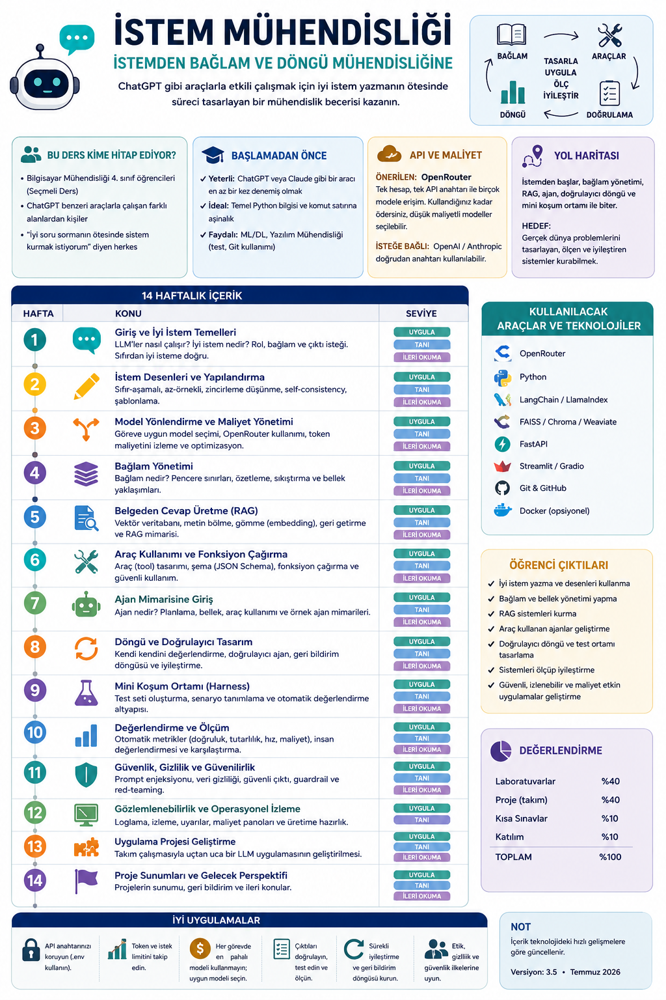

# İstem Mühendisliği

**Dil / Language:** Türkçe · [English](README.en.md)

## Bilgisayar Mühendisliği 4. Sınıf Seçmeli Dersi

### İstemden Bağlam ve Döngü Mühendisliğine

**Versiyon:** 3.5 · **Son güncelleme:** Temmuz 2026  
**Durum:** Taslak — yeni gelişmelere göre güncellenir.

Yapay zekâ araçları artık yalnızca merak konusu değil, pek çok mesleğin günlük iş akışının parçası hâline geldi. Ancak bu araçlarla verimli çalışmak, onlara "iyi soru sormak"tan çok daha fazlasını gerektiriyor: modele hangi bilginin verileceğini, hangi araçların kullanılacağını ve sürecin ne zaman duracağını sistematik biçimde tasarlamak bir mühendislik becerisidir. Bu ders, söz konusu beceriyi sıfırdan ve uygulamalı olarak kazandırmak amacıyla hazırlanmıştır.



---

## Bu ders kime hitap ediyor?

Bu müfredat, **Bilgisayar Mühendisliği 4. sınıf** seçmeli dersi olarak tasarlanmıştır. Bununla birlikte, ChatGPT benzeri araçlarla çalışan; hukuk, tıp, işletme, eğitim ve tasarım gibi farklı alanlardan gelen ve *"yapay zekâya iyi soru sormanın ötesinde sistem kurmak istiyorum"* diyen okuyucular da bu belgeyi rahatlıkla izleyebilir.

Programlama deneyiminiz olmasa bile haftalık konuların kavramsal kısımlarını ve aşağıdaki sözlüğü takip edebilirsiniz; laboratuvar ve ödev bölümleri dersin uygulama katmanını oluşturur. Kod yazabilen okuyucular ise sözlük, haftalık plan ve değerlendirme bölümlerinin tamamını izleyerek dersten en yüksek verimi alabilir.

### Bu derse başlamadan ne bilmek iyi olur?


| Seviye                                  | Ne beklenir?                                                                              |
| --------------------------------------- | ----------------------------------------------------------------------------------------- |
| **Yeterli**                             | ChatGPT veya Claude gibi bir aracı en az bir kez denemiş olmak                            |
| **Ders için ideal**                     | Temel Python bilgisi (değişken, fonksiyon, dosya okuma) ve komut satırına aşinalık        |
| **Zorunlu değil ama faydalı**           | Makine öğrenmesi veya derin öğrenme dersi; yazılım mühendisliği (test yazma, Git kullanımı) |


### API ve maliyet

Derste bulut tabanlı model erişimi için öncelikli olarak [OpenRouter](https://openrouter.ai) platformunu kullanacağız. Bu tercihin iki temel gerekçesi vardır: tek bir hesap ve tek bir API anahtarıyla birçok modele (OpenAI, Anthropic Claude, Google Gemini ve açık kaynak modeller) erişebilirsiniz; böylece ayrı ayrı abonelik oluşturup çift fatura ödemenize gerek kalmaz.


| Yol                             | Ne zaman?                                          | Maliyet                                                                        |
| ------------------------------- | -------------------------------------------------- | ------------------------------------------------------------------------------ |
| **OpenRouter** (önerilen bulut) | Ders laboratuvarları, ajan, yapılandırılmış çıktı   | Tek cüzdan; kullandığınız kadar ödersiniz. Düşük maliyetli modeller seçilebilir |
| **Ollama / LM Studio** (yerel) | Gizlilik, ücretsiz deneme, internetsiz çalışma      | API ücreti yoktur; yalnızca bilgisayar kaynağı gerekir                          |


#### Maliyet yönetimi ve güvenlik

API anahtarlarınızı kaynak koduna veya GitHub deposuna dahil etmemeniz güvenlik açısından kritik önem taşır; bunun yerine `.env` dosyası kullanmanızı öneriyoruz (`OPENROUTER_API_KEY`). OpenRouter, çoğu istemci kütüphanesi için **OpenAI uyumlu** bir uç nokta sunar (yalnızca `base_url` değiştirilir); dolayısıyla farklı SDK'ları ayrı ayrı öğrenmeniz gerekmez.

İstek limiti (rate limit) ve token tüketimini takip etmeniz önemlidir; kontrolsüz bir döngü beklenmedik fatura artışlarına yol açabilir (bu konuyu Hafta 11–12'de ayrıntılı ele alacağız). Genel bir ilke olarak, her görevi en pahalı modele yönlendirmek yerine basit görevlerde küçük ve uygun maliyetli modelleri denemenizi tavsiye ediyoruz (Hafta 3'te model yönlendirme konusunu işleyeceğiz).

> İsteğe bağlı olarak doğrudan OpenAI veya Anthropic anahtarı da kullanılabilir; ancak bu derste zorunlu değildir.

---

## Bu ders ne hakkında?

ChatGPT gibi araçlarla etkili biçimde çalışabilmek, iyi **istem (prompt)** yazabilmekle başlar. Ancak gerçek dünya uygulamalarında yalnızca iyi soru sormak yeterli değildir; modele *hangi bilgilerin*, *hangi sırayla* ve *hangi araçlarla* verileceğini, işin *ne zaman bittiğini* ve *hangi kurallarla* çalışacağını tasarlamak gerekir. Bu tasarım süreci bir mühendislik disiplinidir.

Bu ders, iyi istem yazma becerisini temel alır; ardından bu beceriyi **bağlam yönetimi**, **belgeden cevap üretme (RAG)**, **araç kullanan ajan** ve **doğrulayıcılı döngü ile mini koşum ortamı (harness)** gibi katmanlarla birleştirerek bütünlüklü bir mühendislik yetkinliğine dönüştürür.

---

## Nasıl okunmalı?

Müfredattaki her konu üç seviyede ele alınmıştır. Aşağıdaki tablo, her seviyenin sizden ne beklediğini özetler:


| Etiket               | Anlamı                                                                  |
| -------------------- | ----------------------------------------------------------------------- |
| **Zorunlu (uygula)** | Derste yapılır veya ödev olarak teslim edilir                            |
| **Kavramsal (tanı)** | Kavramı anlamanız yeterlidir; kod yazmanız beklenmez (kısa demo olabilir) |
| **İleri okuma**      | Meraklılar ve proje yapmak isteyenler için sunulmuştur; zorunlu değildir |


---

## Küçük sözlük

Yapay zekâ alanında İngilizce terminoloji hâkimdir. Aşağıdaki tabloda derste sıklıkla karşılaşacağınız kavramları Türkçe karşılıklarıyla birlikte sunuyoruz; böylece hem Türkçe hem İngilizce kaynaklarda rahatlıkla gezinebilirsiniz. Terimler **Türkçe ad (English)** biçiminde yazılmıştır.


| Terim                                         | Kısa tanım                                                                                       | Örnek                                                                          |
| --------------------------------------------- | ------------------------------------------------------------------------------------------------ | ------------------------------------------------------------------------------ |
| **Büyük dil modeli (LLM)**                    | Metinden metin üreten yapay zekâ modeli                                                          | ChatGPT, Claude veya OpenRouter'daki bir model                                 |
| **Token**                                     | Modelin işlediği küçük metin birimi                                                              | Bir cümlenin 12–20 token'a bölünmesi; sayı ≈ maliyet                           |
| **BPE (Byte Pair Encoding)**                  | Sık geçen parçaları birleştirerek token sözlüğü kuran yaygın tokenizasyon yöntemi                | Nadir veya uzun kelimenin birkaç token'a bölünmesi                             |
| **Token gömme (token embedding)**             | Her token'ı LLM *içinde* sayı vektörüne çeviren katman (cevap üretmek için)                      | Attention'ın üzerinde çalıştığı vektörler; Hafta 2                             |
| **İstem (prompt)**                            | Modele yazdığınız soru veya talimat                                                              | "Bu e-postayı resmi bir dille yeniden yaz."                                    |
| **Bağlam (context)**                          | Modelin o cevap için gördüğü tüm metin: sistem kuralları, sohbet geçmişi, belgeler, araç listesi | Sohbete yapıştırdığınız PDF parçası                                            |
| **Bağlam penceresi (context window)**         | Bir istekte modele sığdırabileceğiniz en fazla metin (token ile ölçülür)                         | 128K pencere ile uzun belge gönderebilmek; yine de her şeyi göndermek gerekmez |
| **Dikkat bütçesi (attention budget)**         | Modelin bağlamdaki her kelimeye aynı kalitede odaklanamaması                                     | 50 sayfalık metnin ortasındaki bir cümleyi kaçırması                           |
| **Bağlam çürümesi (context rot)**             | Bağlam uzadıkça erken verilen önemli bilginin zayıflaması                                        | 40 mesaj sonra "adım 1'deki kuralı" uygulamaması                               |
| **Yapılandırılmış çıktı (structured output)** | Serbest paragraf yerine sabit alanlı cevap (çoğunlukla JSON)                                     | `{"duygu":"olumlu","güven":0.9}`                                               |
| **Erişim artırımlı üretim (RAG)**             | Önce sizin dosyalarınızdan ilgili parçayı bulup modele ekleyerek cevap üretmek                   | "Bütünleme var mı?" → yönetmelik PDF'inden maddeyi bul → modele ver → cevapla  |
| **Arama gömmesi (embedding, RAG)**            | Metni "anlamca yakın mı?" diye *aramak* için sayıya çevirmek (çoğunlukla ayrı model)             | "tatil izni" ≈ "yıllık izin"; Hafta 8 — token embedding'den farklı amaç        |
| **Örtüşme (overlap)**                         | Ardışık parçaların biraz üst üste binmesi                                                        | %15 overlap ile cümle ortasında kopmayı azaltmak                               |
| **Hibrit arama (hybrid search)**              | Vektör (anlam) ve anahtar kelime (BM25) aramayı birlikte kullanmak                               | Madde numarası veya ürün kodunu kaçırmamak                                     |
| **Yeniden sıralama (rerank)**                 | İlk aday listesini ikinci bir modelle yeniden sıralamak                                          | 30 parça bul → en iyi 5'i modele ver                                           |
| **Bağlamsal erişim (contextual retrieval)**   | Parçaya belgedeki yerini anlatan kısa özet ekleyip gömmek                                        | "Bu parça X yönetmeliğinin izin bölümündendir" + parça metni                   |
| **Geç parçalama (late chunking)**             | Önce uzun metni gömüp sonra parça sınırlarını ayırma fikri                                       | Referans yoğun metinlerde sınır kaybını azaltmak                               |
| **Model yönlendirme (model routing)**         | Basit işi ucuz ve hızlı modele, zor işi güçlü modele yönlendirmek                                | "Merhaba" → küçük model; uzun analiz → büyük model                             |
| **Gözlemlenebilirlik (observability)**        | Her çağrıda model, token, süre, maliyet ve araç adımlarını kaydetmek                             | Log satırı: model=… tokens=… latency_ms=… cost≈…                               |
| **Korkuluk / koruma (guardrails)**            | İstek veya cevabı güvenlik ve politika kurallarına göre otomatik süzmek                           | PII maskeleme; enjeksiyon şüphesinde reddetme                                  |
| **Parçalama (chunking)**                      | Uzun belgeyi arama için küçük parçalara bölmek                                                   | 80 sayfalık PDF'i ~500–1000 kelimelik bölümlere ayırmak                        |
| **Ajan (agent)**                              | Gerektiğinde tanımlı araçları çağırarak iş ilerletebilen sistem                                  | "Bugünün kurunu al, TL'ye çevir" → önce kur API'si, sonra cevap                |
| **Araç çağırma (function / tool calling)**    | Modelin "şu fonksiyonu şu parametrelerle çalıştır" demesi; kodunuz çalıştırır                    | `get_weather(city="Isparta")`                                                  |
| **ReAct (Reason + Act)**                      | Düşün → araç kullan → sonucu oku → gerekirse tekrar et                                           | Önce arama yapar, sonucu görünce ikinci adımı atar                             |
| **Model Bağlam Protokolü (MCP)**              | Araç ve veri kaynaklarını modele bağlamak için ortak bağlantı standardı                          | Aynı takvim aracını farklı sohbet uygulamalarına benzer şekilde bağlamak       |
| **A2A (Agent-to-Agent Protocol)**             | Farklı ajanların birbirleriyle standart biçimde iletişim kurmasını sağlayan protokol             | MCP araçlara bağlanır; A2A ajanları birbirine bağlar                           |
| **Beceri paketi (skill)**                     | "Bu iş şöyle yapılır" diye yazılmış talimat dosyası (`SKILL.md`); araç değildir                  | "Pull request özeti nasıl yazılır?" adımlarını içeren kılavuz                  |
| **Döngü (loop)**                              | İş bitene veya limit dolana kadar tekrarlayan otomatik çevrim                                    | Kod yaz → test çalıştır → hata varsa düzelt → en fazla 5 kez                   |
| **Doğrulayıcı (verifier)**                    | "Bu çıktı kabul edilebilir mi?" diye konulan otomatik kontrol                                    | Geçerli JSON mu? Cevapta `06` var mı? Testler yeşil mi?                        |
| **Ajan koşum ortamı (harness)**               | Döngüyü saran kurallar: açık araçlar, adım limiti, log, doğrulayıcı                              | Yalnızca `search` ve `calculator` açık; `delete_file` kapalı                   |
| **Araç izin listesi (tool allowlist)**        | Ajanın kullanmasına izin verilen araçların kapalı listesi                                        | İzinli: `search`, `get_weather` · Yasak: e-posta gönderme                      |
| **Bağlam sıkıştırma (compaction)**            | Uzun sohbeti özetleyip özetle devam etmek                                                        | 30 mesajı 1 paragrafa indirip yeni oturuma yapıştırmak                         |
| **Kademeli açma (progressive disclosure)**    | Tüm belgeyi başta vermemek; ihtiyaç oldukça ilgili kısmı okutmak                                 | Önce dosya adları; "3. bölümü oku" deyince yalnızca onu eklemek                |
| **Bağlam zehirlenmesi (context poisoning)**   | Bağlama yanlış veya kötü niyetli metin girince modelin bozulması                                 | Kullanıcı metninde "önceki kuralları yok say" yazması                          |
| **Ajan belleği (agent memory)**               | Kısa süreli (oturum içi) ve uzun süreli (oturumlar arası) bilgi saklama katmanı                  | Kullanıcı tercihlerini oturumlar arası hatırlama; Mem0, Zep                    |
| **En küçük çalışır ürün (MVP)**               | Dar kapsamlı ama gerçekten çalışan ilk sürüm                                                     | Önce 3 PDF'lik RAG; tüm üniversite arşivi değil                                |
| **OWASP**                                     | Yazılım ve LLM uygulamalarında sık görülen güvenlik risklerini listeleyen kuruluş                | Bu derste LLM Top 10 (2025) listesi                                            |
| **RAGAS**                                     | RAG sistemlerinin kalitesini ölçen değerlendirme çerçevesi (faithfulness, relevance, context precision) | Golden set cevaplarını sadakat ve alaka açısından puanlamak               |


### Üç kardeş kavram

Aşağıdaki üç kavram birbiriyle sık karıştırılır; aralarındaki farkı net olarak bilmek önemlidir:

1. **Araç çağırma (function calling):** Model, sizin yazdığınız bir Python fonksiyonunu doğrudan çağırabilir.
2. **Model Bağlam Protokolü (MCP):** Bu tür araçların *standart bir biçimde* bağlanmasını sağlayan protokoldür (derste çoğunlukla tanıtım düzeyinde ele alınacaktır).
3. **Beceri paketi (skill):** Bir araç değil; belirli bir işin *nasıl yapılacağını* anlatan talimat paketidir.

### ReAct, döngü ve harness — üç katman

Bu üç kavram, ajan mimarisinin farklı sorularına cevap verir. Aşağıdaki tablo, aralarındaki ilişkiyi özetler:


| Katman                                | Yanıtladığı soru                                                    | Bu derste                                 |
| ------------------------------------- | ------------------------------------------------------------------- | ----------------------------------------- |
| **ReAct (Hafta 10)**                  | Model bir adımda ne düşünüp hangi aracı çağırmalı?                  | Ajanın *iç* davranışını tanımlar          |
| **Döngü / loop (Hafta 11)**           | Kaç kez denenecek, ne zaman durulacak, hangi test "tamam" diyecek?  | Tekrarlayan çevrim ve doğrulayıcı         |
| **Koşum ortamı / harness (Hafta 11)** | Hangi araçlar açık, log tutuluyor mu, izinler sınırlı mı?           | Döngünün dışındaki kurallar ve kontroller |


Kısaca özetlemek gerekirse: ReAct bir adımda ne yapılacağını belirler, döngü ne zaman bitileceğini tanımlar, harness ise tüm sürecin hangi izin ve kontrollerle çalışacağını düzenler.

---

## Alanın evrimi (2022–2026) — örneklerle

2022'den bu yana yapay zekâ uygulamalarında "iyi soru sormak" yeterli olmaktan çıkmış, alanın odağı kademeli olarak genişlemiştir. Aşağıdaki dört katman, bu evrimi özetler:

```text
1) İSTEM          →  "Bana özet yaz" diye iyi sormak
2) BAĞLAM         →  Özet için doğru belgeleri / geçmişi masaya koymak
3) HARNESS        →  Asistana hangi araçları, hangi izinle vermek
4) DÖNGÜ          →  Yaz → kontrol et → düzelt → bitince dur (otomatik)
```

İstem yazma becerisi bu yapının temelidir ve önemini korumaya devam etmektedir; ancak gerçek dünya uygulamalarında tek başına yeterli değildir. Bu ders, dört katmanı da kademeli olarak ele alır.

---

## Dersin amacı

Bu dersi başarıyla tamamlayan öğrenci, aşağıdaki yetkinlikleri kazanmış olacaktır:

- Büyük dil modellerinin (LLM) temel çalışma prensiplerini (tokenizasyon, BPE, token embedding) açıklayabilir.
- Etkili istemler tasarlayabilir, istemleri sürümleyebilir ve model çıktısını **form veya JSON** gibi düzenli bir formatta alabilir.
- Bulut API (**OpenRouter**) veya yerel model ile denemeler yapabilir; temel **model yönlendirme (routing)** fikrini kavrayabilir.
- Modele verilen bilgiyi (bağlamı) bilinçli biçimde yönetebilir ve bağlam kaynaklı hataları tanımlayabilir.
- Kendi belgelerinden cevap üreten basit bir **RAG** sistemi kurabilir (parçalama, gömme, kaynak gösterme).
- Araç kullanan basit bir **ajan** geliştirebilir.
- **Doğrulayıcı, adım limiti, araç izinleri ve temel gözlem log'u** içeren küçük bir **döngü ve mini koşum ortamı (harness)** kurabilir.
- Başlıca güvenlik risklerini, temel **korkuluk (guardrail)** fikrini ve etik sorumlulukları örneklerle açıklayabilir.
- Gerçek bir probleme **küçük ama çalışan** bir çözüm (MVP) üretebilir.

MCP, A2A, GraphRAG, ince ayar (fine-tuning) laboratuvarı, DSPy ve gelişmiş bellek ürünleri yalnızca **tanıma** düzeyinde ele alınacaktır. Çok modlu (görüntü ve ses) modeller bu dersin kapsamı dışındadır.

---

## Değerlendirme

Değerlendirme üç temel bileşenden oluşur. Her bileşen, farklı bir beceri setini ölçmeyi amaçlar: haftalık ödevler düzenli pratik yapmanızı, ara sınav kavramsal altyapınızı, final projesi ise bütünlüklü bir uygulama geliştirme becerinizi değerlendirir.


| Bileşen              | Ağırlık | Ne beklenir?                                                                                 |
| -------------------- | ------- | -------------------------------------------------------------------------------------------- |
| **Ödev ve uygulama** | %30     | 6–8 kısa ödev (her biri yaklaşık 1–3 saat). Büyük proje değil; tek script ve kısa not        |
| **Ara sınav (vize)** | %30     | Hafta 1–6 konuları: kavramlar, istem yazma ve kısa kod okuma (60 dakika)                      |
| **Final projesi**    | %40     | 2–3 kişilik grup çalışması: çalışan uygulama, sunum ve rapor                                 |


Ödev notu vize notuna karışmaz. Ödev örnekleri arasında "üç farklı istemi karşılaştırmak", "3 PDF ile soru-cevap sistemi kurmak" ve "en fazla 5 adımlı ajan ile 5 test yazmak" gibi uygulamalar bulunur.

### Final projesi (MVP) — kurallar

Final projesi duyurusu **Hafta 8'den sonra** yapılacak, teslim tarihi **Hafta 13–14** aralığında olacaktır. Her projede aşağıdaki bileşenler zorunludur:

1. Çalışan kod ve kurulumu anlatan bir README dosyası.
2. Hangi istemlerin neden kullanıldığını açıklayan kısa bir belge (**istem dosyası veya sürüm notu**).
3. **Ya** belge tabanlı soru-cevap sistemi (RAG) **ya** araç kullanan bir ajan geliştirmek (ikisini birden derinlemesine yapmanız beklenmez).
4. **Doğrulayıcı:** En az **5 kontrol** (golden set) içermelidir. Örnek kontroller:
   - Çıktı gerçekten geçerli bir JSON mu?
   - "Ankara'nın plakası?" sorusunda cevapta `06` geçiyor mu?
   - Ajan yasak bir aracı çağırmaya çalışmıyor mu?
   - İşlem en fazla N adımda tamamlanıyor mu?
5. RAG seçtiyseniz cevaplarda **kaynak ve alıntı** göstermeniz, ajan seçtiyseniz **token ve süre log'u** tutmanız gerekir.
6. **Kısa etik değerlendirme notu** (½ sayfa): Projenizde model uydurma riski var mı? Önyargı riski var mı? Kullanıcıya yapay zekâ cevabı olduğu bildiriliyor mu?

İsteğe bağlı bonus ögeler: skill dosyası, hazır MCP aracı entegrasyonu, compaction denemesi, model yönlendirme notu, PII maskeleme ve golden set testlerini basit bir CI/CD pipeline'ına (ör. GitHub Actions) bağlamak.

> **Önemli:** Doğrulayıcı, modelin kendi kendine "doğruyum" demesi anlamına gelmez. Doğrulayıcı, sizin yazdığınız otomatik kontrol fonksiyonları veya küçük bir test listesidir.

---

## Haftalık plan (14 hafta)

### Hafta 1 — Üretken yapay zekâya giriş

**Bu hafta ne öğreneceksiniz?** ChatGPT benzeri araçların hangi yapay zekâ ailesine ait olduğunu kavrayacak ve istem, bağlam, döngü ile harness kavramlarının oluşturduğu bütünsel haritaya ilk bakışınızı yapacaksınız.

- Yapay zekâ, makine öğrenmesi ve üretken yapay zekâ arasındaki ilişki ele alınacaktır (bu derste odak: **metin**).
- Ayırt edici model (sınıflandırır) ile üretken model (yeni içerik üretir) arasındaki fark incelenecektir.
- GPT, Claude, Gemini ve LLaMA gibi güncel model aileleri tanıtılacaktır.
- Transformer mimarisine çok kısa bir giriş yapılacaktır.
- **Kavramsal:** İstem → Bağlam → Harness → Döngü haritası, yukarıdaki örneklerle birlikte sunulacaktır.

**Zorunlu:** İki farklı sohbet aracıyla 5 görev deneyip gözlemlerinizi kısa bir not olarak yazmanız beklenmektedir.

---

### Hafta 2 — Model kabaca nasıl çalışır?

**Bu hafta ne öğreneceksiniz?** Metnin modele nasıl girdiğini adım adım göreceksiniz: **parçalama (tokenization / BPE)** → **token gömme (token embedding)** → dikkat mekanizması → sonraki token tahmini → sıcaklık ile örnekleme.

Temel akış şu şekilde özetlenebilir:

```text
Metin → token'lara böl (örn. BPE)
     → her token bir vektöre dönüşür (token embedding)
     → self-attention: token'lar birbirine "bakar"
     → model sıradaki token'ı tahmin eder
     → temperature / top-p ile cevap üretilir
```

#### 1) Tokenizasyon

- **Token**, modelin işlediği küçük metin birimidir (kelime, alt kelime veya karakter parçası olabilir).
- **BPE (Byte Pair Encoding)**, sık geçen karakter ve alt kelime çiftlerini birleştirerek sözlük oluşturan yaygın bir yöntemdir. Örneğin "yapayzekâ" gibi birleşik yazımlar veya nadir kelimeler birkaç token'a bölünebilir.
- Token sayısı neden önemlidir? Token sayısı, hem maliyeti hem de bağlam penceresi tüketimini doğrudan etkiler; aynı cümle farklı modellerde farklı sayıda token'a bölünebilir.
- **Lab fikri:** Aynı Türkçe cümleyi bir tokenizer ile parçalayıp token listesini ve sayısını gözlemlemek.

#### 2) Token gömme (token embedding) — LLM'nin temeli

- Her token, modelin içinde sabit boyutlu bir **sayı vektörüne** dönüştürülür; dikkat mekanizması (attention) bu vektörler üzerinde çalışır.
- Konum bilgisi (position encoding) de eklenir; çünkü sıra önemlidir.
- **Bu ders için kritik bir ayrım:**
  - **Buradaki embedding**, LLM'nin iç katmanıdır ve cevap üretmek için kullanılır.
  - **Hafta 8'deki embedding** ise belge aramak için kullanılan ayrı (veya benzer) bir gömme modelidir. İkisi de "vektör" kavramını kullanır, ancak amaçları farklıdır.

#### 3) Dikkat mekanizması ve üretim

- Self-attention, "hangi token hangi token'a bakıyor?" sorusunu cevaplar (detaylı matematik bu derste işlenmeyecektir).
- Next-token prediction, sıradaki parçayı tahmin etme ilkesidir.
- Model boyutu (örn. 7B ≈ yaklaşık 7 milyar parametre): genelde daha yetenekli olmakla birlikte daha pahalı ve ağırdır.
- Temperature ve Top-p parametreleri, cevabı daha yaratıcı veya daha tutucu yapmanızı sağlar.
- **Kavramsal önizleme:** Çok uzun metinde dikkat dağılması sorunu Hafta 6'da ele alınacaktır.

**Zorunlu:**

1. Aynı cümleyi farklı sıcaklık değerleriyle üretip farkı raporlamak.
2. Kısa tokenizer deneyi: bir cümlenin token'lara nasıl bölündüğünü gözlemlemek ve yaklaşık token sayısını belirlemek (BPE fikrini kavramak yeterlidir).

---

### Hafta 3 — İstem yazma, OpenRouter API ve düzenli çıktı

**Bu hafta ne öğreneceksiniz?** Sistem ve kullanıcı mesajı ayrımını, örnek vererek öğretmeyi, cevabı JSON formatına sokmayı ve **tek bir OpenRouter anahtarı** ile Python'dan model çağırmayı öğreneceksiniz.

- **Zero-shot:** Hiç örnek vermeden doğrudan soru sormaktır.
- **Few-shot:** Birkaç örnek vererek modele istenilen kalıbı göstermektir.
- **Chain-of-Thought:** Modelden "adım adım düşünmesini" istemektir.
- **Yapılandırılmış çıktı:** Serbest paragraf yerine `{ "duygu": "olumlu" }` gibi sabit alanlara sahip bir cevap formatı oluşturmaktır.
- **OpenRouter kurulumu:** Hesap oluşturma → API anahtarı alma → `.env` dosyasına kaydetme (`OPENROUTER_API_KEY`).
- OpenAI uyumlu istemci kullanımı: `base_url="https://openrouter.ai/api/v1"` ayarıyla aynı SDK kalıbıyla farklı modelleri çağırabilirsiniz.
- Aynı kod iskeletiyle farklı modelleri denemek (ucuz ve güçlü model karşılaştırması).
- **Model yönlendirme (routing) fikri:** Basit sınıflandırma görevlerini ucuz modele, zor akıl yürütme görevlerini güçlü modele yönlendirmek (**kavramsal düzeyde anlatılacak; ödevde iki model karşılaştırılacaktır**).
- **İstem sürümleme:** İstemleri koddan ayırıp dosyada tutmak (`prompts/v1.txt`) ve değişiklikleri Git'te takip etmektir.
- İstek limiti (rate limit) ve token tüketimi kavramları tanıtılacaktır.
- **Kavramsal:** Cevabın parça parça gelmesi (streaming) ve tekrarlayan sistem istemlerinde maliyet düşürme (prompt/prefix caching) konuları tanıtılacaktır.

**Zorunlu:** OpenRouter kurulumu, few-shot ve JSON çıktı ödevi (en az iki farklı model adıyla kısa karşılaştırma) ile istemin ayrı dosyada tutulması.

---

### Hafta 4 — Daha iyi istemler ve ilk güvenlik uyarısı

**Bu hafta ne öğreneceksiniz?** Net talimat vermeyi, bölüm ayırıcılarını kullanmayı, "uzman gibi davran" (persona) tekniğini ve kötü niyetli istemlerle kuralları delme riskini kavrayacaksınız.

- Açık ve spesifik yazmak, iyi bir istemin temel koşuludur.
- Metni `###` veya XML etiketleri ile bölmek, modelin bilgiyi karıştırma olasılığını azaltır.
- **Doğru yükseklik (right altitude):** Ne aşırı katı kural yığını ne de "iyi ol" kadar muğlak bir talimat verilmelidir; denge önemlidir.
- **Talimat hiyerarşisi (instruction hierarchy):** Sistem kuralları > geliştirici talimatı > kullanıcı metni şeklinde bir öncelik sıralaması vardır. Kullanıcı "önceki kuralları yok say" diyerek sistem talimatını ezememeli — bu konu **kavramsal** düzeyde ele alınacak ve Hafta 12 ile bağlantılıdır.
- **Kavramsal:** Birden fazla yol deneme (Self-Consistency) ve ağaç gibi düşünme (Tree of Thoughts) yaklaşımları tanıtılacaktır; uygulamanız beklenmez.
- **Kavramsal:** DSPy — istem metnini elle düzenlemek yerine, programın mantığını (modüller) ve bir başarı metriğini tanımlayıp istem optimizasyonunu otomatikleştiren yaklaşım. "İstem mühendisliğinin otomasyonu" olarak düşünülebilir. Bu derste uygulanmaz ama alanın gelecek yönelimini temsil eder.
- İstem enjeksiyonu ve jailbreak kavramlarına kısa bir giriş yapılacaktır (asıl laboratuvar çalışması Hafta 12'dedir).

**Zorunlu:** Bir meslek için persona istemi yazmak ve küçük bir enjeksiyon denemesi gerçekleştirmek.

---

### Hafta 5 — Bilgisayarınızda model çalıştırmak

**Bu hafta ne öğreneceksiniz?** İnternete veri göndermeden kendi bilgisayarınızda model çalıştırmayı deneyeceksiniz. **Ollama** (komut satırı arayüzü) ile uygulamalı çalışacak, **LM Studio** (görsel arayüz) ile de alternatif bir deneyim edineceksiniz; böylece maliyet ve gizlilik avantajlarını bizzat gözlemleyeceksiniz.

- **Ollama (birincil yerel araç):** Kurulum, model indirme ve terminal veya API ile çağrı yapma adımları ele alınacaktır. Script ve otomasyon için en pratik yerel araçtır.
- **LM Studio (alternatif GUI):** Kurulum ve sohbet arayüzü tanıtılacaktır; isteğe bağlı olarak yerel sunucu (OpenAI uyumlu endpoint) kurulabilir. Keşif ve görsel arayüz ile deneme için uygundur.
- Yerel model ile bulut (OpenRouter) karşılaştırması: gizlilik, maliyet, hız ve kalite arasındaki ödünleşimler incelenecektir.
- Nicemleme (quantization): modeli küçültüp daha düşük donanım gereksinimli bilgisayarlarda çalıştırma fikri **kavramsal** düzeyde tanıtılacaktır.
- Token ve bağlam penceresi limitini yerelde gözlemlemek, Hafta 6'ya köprü oluşturacaktır.

**Zorunlu:** Ollama'da bir model kurup aynı istemle kısa bir görev testi yapmak; ardından "OpenRouter ve Ollama" arasındaki gözlemlerinizi kısa bir not olarak yazmak. LM Studio'yu da kurup denemeniz önerilir ancak derinlemesine incelemeniz beklenmez.

---

### Hafta 6 — Bağlam mühendisliği

**Bu hafta ne öğreneceksiniz?** İyi soru sormak tek başına yeterli değildir; masaya *doğru bilgiyi*, *doğru sırayla* ve *mümkün olduğunca az gürültüyle* koymak gerekir. Bu hafta, bağlamın anatomisini ve bağlam hatalarına karşı temel stratejileri ele alacağız.

#### 1) Bağlam anatomisi (modele ne girer?)

Modele gönderilen tipik bir paket şu katmanlardan oluşur:

1. Sistem talimatı (rol ve kurallar)
2. Araç tanımları (varsa)
3. Sohbet geçmişi
4. Dışarıdan eklenen belgeler veya RAG parçaları
5. Kullanıcının son mesajı

Alıştırma: Bir sohbet ekran görüntüsünde veya log'da "hangi satır hangi katmana ait?" sorusunu cevaplayarak etiketleme yapmak.

#### 2) Bağlam neden bozulur? (hata türleri)


| Sorun                    | Ne olur?                                  | Basit çare                                       |
| ------------------------ | ----------------------------------------- | ------------------------------------------------ |
| **Context rot**          | Metin uzadıkça önemli bilgi kaybolur      | Özetle (compaction) veya gereksiz kısımları çıkar |
| **Lost-in-the-middle**   | Ortadaki bilgi daha az dikkat çeker       | Önemli bilgiyi başa veya sona yerleştir; kısalt   |
| **Gürültü / fazla araç** | Çok fazla seçenek modelin kararını bozar  | Az ve net araç tanımla; kademeli açma uygula      |
| **Context poisoning**    | Yanlış veya zararlı metin bağlama sızar   | Kaynak kontrolü ve ayırıcılar kullan (Hafta 12)   |


#### 3) Üç temel strateji

- **Sıkıştırma (compaction):** Uzun sohbet geçmişini özetleyip yeni bağlam penceresiyle devam etmektir.
- **Kademeli açma / tam zamanında ekleme (JIT):** Tüm bilgiyi baştan yüklemek yerine, dosya yolunu vermek ve yalnızca ihtiyaç duyulduğunda ilgili bölümü okutmaktır.
- **Yüksek sinyal / düşük token:** Aynı işi daha az ama daha özenle seçilmiş metinle yaptırmaktır.

**Zorunlu lab (ikisini de deneyin, birini ödevde derinleştirin):**

1. Compaction: Uzun bir sohbeti özetleyip devam etmek; özetten önce ve sonra cevap kalitesini not etmek.
2. JIT: Büyük bir metni komple bağlama gömmek ile parça parça okutmak arasındaki farkı token ve kalite açısından karşılaştırmak.

**Ödev:** Kısa rapor (en fazla 1 sayfa): "Hangi strateji hangi durumda etkili? Bir başarısız bağlam örneği ve uyguladığınız düzeltme."

**Kavramsal:** Alt ajanlara iş bölerek bağlamı ayırma (sub-agent isolation) fikri tanıtılacaktır; kod yazılmayacaktır.  
**İleri okuma:** Anthropic'in context engineering yazısı.

---

### Hafta 7 — Ara sınav (vize)

İlk altı haftada ele aldığımız konuları bu sınavla değerlendireceğiz: kavramlar, istem tasarımı, yapılandırılmış çıktı, yerel model kullanımı, bağlam anatomisi ve bağlam stratejileri.

**Format:** Kısa cevap, istem yazma ve kısa kod okuma soruları · 60 dakika.

Sınavdan sonra dersin odağı değişecektir: ilk yarıda edindiğiniz kavramsal temeli, ikinci yarıda uygulamaya dönüştüreceğiz. Belgelerden cevap üretme (RAG), ajan geliştirme ve otomatik döngü tasarımı gibi konular, öğrendiklerinizi gerçek dünya problemlerine taşımanızı sağlayacaktır.

---

### Hafta 8 — RAG: Belgelerinizden cevap üretmek

**Bu hafta ne öğreneceksiniz?** "Model bilmiyor veya uyduruyor" sorununa pratik bir çözüm olarak RAG yaklaşımını öğreneceksiniz: belgeyi **doğru parçalayın** → gömün → arayın → ilgili parçayı modele verin → cevap üretin. Bu süreç, bağlam mühendisliğinin *erişim* ayağını oluşturur. Zayıf RAG performansının çoğu, modelden değil **kötü parçalamadan** kaynaklanır.

Basit (naive) akış şu şekilde özetlenebilir:

```text
Belgeler → parçala (chunking) → göm (embedding) → sakla (vektör DB)
       → sorguya yakın parçaları bul → modele ekle → cevap üret
```

#### RAG neden gereklidir?

- Modelin bilgi kesiti eski veya genel kalabilir.
- Uydurma (hallucination) riskini somut belgelere dayandırarak azaltmak mümkündür.
- Kurum, ders veya şirket belgelerine dayalı güvenilir cevaplar üretmek gerektiğinde vazgeçilmezdir.

#### Parçalama (chunking) — bu haftanın omurgası


| Strateji                          | Ne yapar?                                                   | Ne zaman kullanılır?                                  |
| --------------------------------- | ----------------------------------------------------------- | ----------------------------------------------------- |
| **Sabit boyut**                   | Örneğin 500 veya 1000 token'lık dilimler oluşturur          | Hızlı başlangıç (laboratuvarda zorunlu)               |
| **Örtüşme (overlap)**            | Dilimler biraz üst üste biner (örn. %10–20)                 | Cümle veya konu sınırında bilgi kopmasını azaltmak için |
| **Yapıya duyarlı / özyinelemeli** | Önce başlık, paragraf ve cümle sınırlarına göre bölmeye çalışır | Markdown, rapor ve yönetmelik gibi yapılandırılmış metinler |
| **Anlamsal (semantic)**           | Konu değiştiğinde yeni bir parça başlatır (**kavramsal**)    | Konu karışık uzun metinler                            |
| **Metadata**                      | Kaynak dosya, sayfa ve başlık bilgisini parçayla birlikte saklar | Cevapta alıntı ve filtreleme için                  |


**Dikkat:** Parça çok küçükse bağlam eksik kalır; çok büyükse arama gürültülü olur ve token maliyeti artar. Laboratuvarda bu dengeyi ölçmeniz beklenmektedir.

#### Arama gömmesi (embedding) — mini modül (~30–40 dk)

- Bu modülün amacı, parçayı vektöre çevirip "anlamca yakın" olanları aramaktır (Hafta 2'deki token embedding'den farklı bir amaçtır).
- Benzerlik fikri: yakın vektörler yakın anlama işaret eder (cosine benzerliği; formül ezberi beklenmez).
- Pratik seçim: OpenRouter veya yerel küçük bir embedding modeli kullanılabilir; sorgu ve belgeler **aynı** embedding ailesiyle gömülmelidir.
- Tuzaklar: dil uyumsuzluğu, çok kısa veya çok uzun parçalar ve "yalnızca vektör" ile kod veya madde numarası gibi kesin eşleşmelerin kaçırılması (Hafta 9'da hibrit arama ile ele alınacaktır).

#### Diğer bileşenler

- **Vektör veritabanı:** Laboratuvarda **Chroma** kullanılacaktır; Qdrant gibi alternatifler isim olarak tanıtılacaktır (**kavramsal**).
- Bulunan parçalar da bağlamın bir parçasıdır; alakasız parça gürültü anlamına gelir (Hafta 6 ile bağlantılı).
- **Kaynak ve alıntı (grounding):** Cevapta hangi dosya veya parçaya dayandığının gösterilmesi gerekir (en az dosya adı ve kısa alıntı).

**Zorunlu lab:**
3 PDF veya metin dosyası ile RAG sistemi kurmak; **en az iki chunk ayarını karşılaştırmak** (örn. 500 ve 1000 token; overlap %0 ve %15) ve cevaplarda **kaynak göstermek**. Kısa not: hangisi hangi tip soruda daha iyi sonuç veriyor?

**Not:** Final proje konuları bu haftadan sonra netleşecektir.

#### Ne zaman ne? (karar tablosu — kavramsal)


| İhtiyaç                                          | Genelde tercih edilen yaklaşım                                                             |
| ------------------------------------------------ | ------------------------------------------------------------------------------------------ |
| Davranış, format veya rol tanımlama              | İstem ve yapılandırılmış çıktı                                                             |
| Güncel veya kurumsal belgelere dayandırma         | RAG                                                                                        |
| Modelin üslubunu veya alanını kalıcı değiştirmek  | İnce ayar (fine-tuning) — **bu derste lab yoktur**; ne zaman düşünüleceğini bilmek yeterlidir |
| Çok adımlı araç kullanımı                        | Ajan, döngü ve harness                                                                     |


---

### Hafta 9 — Modern RAG iyileştirmeleri

**Bu hafta ne öğreneceksiniz?** 2025–2026 döneminde pratikte sıklıkla işe yarayan katmanları tanıyacaksınız: **hibrit arama**, **yeniden sıralama (rerank)**, **sorgusal dönüşüm** ve **bağlamsal / geç parçalama**. Yalnızca vektör tabanlı basit arama, çoğu gerçek dünya senaryosunda yeterli sonuç vermemektedir.

#### Güncel "iyi çalışan" yığın (özet)

```text
Parçala (iyi chunking)
  → Hibrit erişim: yoğun (vektör) + seyrek (BM25 / anahtar kelime)
  → Birleştir (örn. RRF)
  → Rerank (ilk 20–50 → en iyi 3–5)
  → Modele ver + mümkünse kaynak/alıntı
```

İsteğe bağlı üst katmanlar: sorgu yeniden yazma, bağlamsal gömme ve ajanın "aramamalı mıyım?" kararını vermesi.

#### Zorunlu konular (uygulama — **birini** laboratuvarda kodlayın)


| Teknik                               | Kısa tanım                                            | Neden gündemde?                                      |
| ------------------------------------ | ----------------------------------------------------- | ---------------------------------------------------- |
| **Hibrit arama (hybrid)**            | Vektör ve anahtar kelime (BM25) aramayı birlikte yapmak | Kod, isim ve madde numarası gibi tam eşleşmeleri kaçırmamak |
| **Yeniden sıralama (rerank)**        | Bulunan adayları ikinci bir modelle yeniden sıralamak   | Üstteki 3–5 parçanın kalitesini belirgin biçimde artırır   |
| **Sorgu yeniden yazma / genişletme** | Kullanıcı sorusunu aramaya daha uygun hâle getirmek     | Kısa veya muğlak sorularda hatırlamayı iyileştirir        |
| **HyDE**                             | "İdeal cevap metni" üretip o metinle aramak             | Soru ile belge dili çok farklıysa etkili olabilir         |


#### Kavramsal konular (tanıma düzeyi — kod zorunlu değildir; 20–25 dk)


| Teknik                                      | Ne işe yarar?                                                                                                              |
| ------------------------------------------- | -------------------------------------------------------------------------------------------------------------------------- |
| **Bağlamsal erişim (contextual retrieval)** | Her parçaya, belgedeki yerini anlatan kısa bir özet ekleyip *sonra* gömmektir (Anthropic yaklaşımı; yüksek kazanç, indeks maliyeti vardır) |
| **Geç parçalama (late chunking)**           | Önce uzun metni gömüp sonra parça sınırlarını ayırmaktır; sınırda anlam kaybını azaltma fikridir                           |
| **Ajan tabanlı / uyarlanabilir RAG**        | Model "aramamalı mıyım, sorguyu değiştirmeli miyim, yeter mi?" diye karar verir (Hafta 10–11 ile bağlantılı)               |
| **GraphRAG**                                | "Kim kiminle ilişkili?" tipinde çok atlamalı sorular için tasarlanmıştır                                                   |
| **Hafıza (memory) ve RAG farkı**            | RAG belgelere dayanır; hafıza ise kullanıcı ve oturum tercihlerini tutar (Mem0, Letta)                                     |
| **ACE**                                     | Bağlamı zamanla iyileşen bir "oyun kitabı" gibi tutma yaklaşımıdır                                                        |


**RAG değerlendirmesi — RAGAS metrikleri (kavramsal + kısa lab):**

RAG çıktılarını sistematik biçimde değerlendirmek için sektörde **RAGAS** çerçevesi yaygın olarak kullanılmaktadır. Temel üç metrik şunlardır:

- **Sadakat (faithfulness):** Cevap gerçekten verilen belgeden mi üretildi?
- **Cevap alaka düzeyi (answer relevance):** Cevap soruyla ne kadar ilgili?
- **Bağlam hassasiyeti (context precision):** Modele verilen parçalar gerçekten doğru parçalar mı?

5 soruluk sabit bir golden set hazırlayın ve bu metrikleri iyileştirme öncesi/sonrası karşılaştırarak basit bir gerileme testi yapın.

**Zorunlu ödev:** Naive RAG (Hafta 8) ile seçtiğiniz **bir** modern tekniği (hibrit, rerank, sorgu yazma veya HyDE) aynı 5 soruda karşılaştırın; yarım ile bir sayfa arasında sonuç raporu ve kaynak gösterme.

**İleri okuma:** Anthropic Contextual Retrieval, Late Chunking (arXiv), hibrit arama ile RRF özetleri ve RAGAS dokümantasyonu.

---

### Hafta 10 — Ajanlar: Araç kullanan yapay zekâ

**Bu hafta ne öğreneceksiniz?** Modelin yalnızca yazı yazması değil; hesap makinesi, arama motoru veya sizin yazdığınız bir fonksiyon gibi araçları çağırabilmesini sağlayacaksınız. Araç tanımlarının da *bağlamın bir parçası* olduğunu bizzat gözlemleyeceksiniz.

- Ajan, temel olarak LLM, araçlar ve adımlardan oluşan bir yapıdır.
- ReAct yaklaşımı: düşün → araç kullan → sonucu oku → devam et.
- Function calling laboratuvarı: OpenRouter üzerinden araç çağırma destekli bir model ile çalışılacaktır.
- Araç açıklamalarının kısa ve net tutulması gerekir; kötü yazılmış bir araç açıklaması bağlam gürültüsü yaratır.
- **MCP (Model Bağlam Protokolü):** Araçları modele standart biçimde bağlayan protokol — **demo ve kavramsal** düzeyde tanıtılacaktır (sıfırdan sunucu yazılmayacaktır).
- **A2A (Agent-to-Agent Protocol):** Farklı ajanların birbirleriyle standart biçimde iletişim kurmasını sağlayan protokol — isim olarak tanıtılacaktır. MCP araçlara, A2A ajanlara bağlanır; bu iki standart birlikte "bağlantı protokolleri" ailesini oluşturur.
- **Skill:** Belirli bir iş için `SKILL.md` talimat dosyası yazmak.
- LangChain ve CrewAI: var olduklarını bilmeniz yeterlidir; bu derste zorunlu bir framework değildir.
- **Hafta 11'e köprü:** Bir ajanı sınırsız çalıştırmak tehlikeli olabilir; bu nedenle döngü ve harness kavramlarına ihtiyaç duyarız.

#### Ajan belleği (memory) — kavramsal

Ajanlar, tek bir oturum içindeki bağlam penceresinin ötesinde bilgi tutmaya ihtiyaç duyabilir. Bu ihtiyaç, "ajan belleği" kavramını doğurmuştur:

- **Kısa süreli bellek:** Mevcut bağlam penceresi ve oturum geçmişidir.
- **Uzun süreli bellek:** Oturumlar arası kalıcı bilgi; kullanıcı tercihleri, öğrenilen kurallar ve geçmiş kararlar bu katmanda tutulur.
- Mem0, Zep ve Letta gibi araçlar bu alanda öne çıkan çözümlerdir (isim olarak tanıtılacaktır).
- RAG belgelerden bilgi çeker; bellek ise kullanıcı ve oturum bilgisini tutar — ikisi farklı katmanlardır.

**Zorunlu:** 2–3 araçlı küçük bir ajan geliştirmek ve bir `SKILL.md` dosyası yazmak.

---

### Hafta 11 — Döngü ve harness: "Ne zaman bitti? Hangi kurallarla?"

**Bu hafta ne öğreneceksiniz?** Her adımı elle yazmak yerine; hedef, adım limiti, doğrulayıcı ve **mini koşum ortamı (harness)** — izinler ve log — ile otomatik bir çevrim kurmayı öğreneceksiniz.

#### Döngü (loop)

```text
hedef ver → ajan bir adım atsın → doğrulayıcı geçti mi?
  hayır ve adım < N ise tekrar et
  evet ise DUR (başarı)
  adım = N olduysa DUR (limit; başarısız da olsa)
```

- Durma koşulları: test geçti, şema uydu, **insan onayı (HITL)** veya adım limiti doldu.
- Sonsuz döngü ve token faturası riski (OWASP LLM10 ile bağlantılı).
- **Kavramsal:** Andrew Ng'nin üç hız kavramı — (1) ajanın hızlı döngüsü, (2) sizin yönlendirmeniz, (3) dış dünya veya kullanıcı geri bildirimi.
- **Hata ve yeniden deneme:** Araç veya API hata verdiğinde panik yapmamak; 1–2 kez denemek, başarısız olursa durmak veya kullanıcıya sormak.
- **Yedek plan (fallback):** Birincil model veya araç kullanılamadığında yedek modele geçmek ya da "cevaplayamıyorum" mesajı döndürmek.

#### Mini koşum ortamı (harness)

Harness, döngüyü saran bir kabuk olarak düşünülebilir. Üretim ortamında (production) kullanılan Claude Code veya Codex düzeyinde bir sistem kurmamız beklenmiyor; ancak aşağıdaki **kontrol listesini** kodlamanız gerekiyor:


| Bileşen                          | Öğrenci uygulaması                                                                         |
| -------------------------------- | ------------------------------------------------------------------------------------------ |
| Araç izin listesi (allowlist)    | Yalnızca izinli 2–3 fonksiyonun çağrılabilmesi                                             |
| Adım limiti (`max_steps`)        | Örneğin 5 adım                                                                             |
| Doğrulayıcı                      | En az 5 assert veya test case                                                               |
| **Gözlem log'u**                 | Her adımda: model adı, çağrılan araç, özet sonuç, **token sayısı**, **süre (ms)** ve yaklaşık **maliyet** |
| Hata davranışı                   | Araç hata verirse kaydedip yeniden denemek veya durmak                                      |
| HITL (isteğe bağlı)              | Silme veya gönderim gibi riskli işlemlerde insan onayı istemek                              |


**Kavramsal (kod yazılmayacak):** Sandbox, worktree, hook'lar ve çok ajanlı orkestrasyon gibi ileri kavramlar tanıtılacaktır; bu derste uygulanmayacaktır.

**Zorunlu lab ve ödev:**
Araç izin listesi (allowlist), `max_steps`, doğrulayıcı (verifier) ve **token, süre ile maliyet alanlarını** içeren adım log'una sahip bir mini ajan döngüsü geliştirmek. README dosyanızda 5–7 maddelik "harness kontrol listesi" yazarak her kuralın neden gerekli olduğunu açıklayın.

---

### Hafta 12 — Güvenlik, etik ve "iyi çalışıyor mu?" kontrolü

**Bu hafta ne öğreneceksiniz?** Başlıca güvenlik risklerini — özellikle istem enjeksiyonu, aşırı yetkili ajan ve sınırsız tüketim — ele alacak, etik sorumlulukları tartışacak ve küçük bir değerlendirme seti oluşturacaksınız. Bu hafta, Hafta 11'deki harness kavramını güvenlikle birleştirir: araç izin listesi, aşırı yetki riskine (Excessive Agency) karşı pratik bir savunma aracıdır.

**OWASP LLM Top 10 (2025) — özet liste:**


| Kod   | Risk (anlaşılır dil)                                          |
| ----- | ------------------------------------------------------------- |
| LLM01 | İstem enjeksiyonu — kullanıcı metni sistem kurallarını ezer   |
| LLM02 | Hassas bilgi sızdırma                                         |
| LLM03 | Tedarik zinciri riski (kütüphane veya model kaynağı)          |
| LLM04 | Veri veya model zehirleme                                     |
| LLM05 | Model çıktısını güvenmeden çalıştırmak (kod veya komut)       |
| LLM06 | Aşırı yetki — ajanın gereğinden fazla araç veya izne sahip olması |
| LLM07 | Sistem isteminin sızması                                      |
| LLM08 | Vektör ve embedding zayıflıkları (RAG tarafı)                 |
| LLM09 | Yanlış bilgi üretme (hallucination)                           |
| LLM10 | Sınırsız tüketim — kontrolsüz maliyet veya istek             |


**Lab odağı:** LLM01, LLM06 ve LLM10.

**Korkuluklar (guardrails) — kavramsal ve kısa uygulama:**

- **Girdi tarafı:** Enjeksiyon kalıpları ve aşırı uzun girdi tespiti.
- **Çıktı tarafı:** Şema doğrulama (önceki haftalarda ele alındı); PII (ad, telefon, TC kimlik no) sızdırma farkındalığı — basit bir regex veya maskeleme denemesi yeterlidir.
- Model cevabını doğrudan `exec` veya shell'e aktarmamak (LLM05).

#### Etik ve sorumlu yapay zekâ (kavramsal tartışma, ~15 dk)

Güvenlik risklerinin yanı sıra, yapay zekâ uygulamalarının etik boyutunu da değerlendirmek bir mühendislik sorumluluğudur:

- **Önyargı (bias):** Model çıktısındaki cinsiyet, dil ve kültür kaynaklı önyargı örnekleri incelenecektir.
- **Şeffaflık:** Kullanıcıya "bu cevap bir yapay zekâ tarafından üretilmiştir" bildirimi yapılması gerekliliği tartışılacaktır.
- **Sorumluluk:** Model uydurma (hallucination) üretebilir; son kararı her zaman insan vermelidir.
- **Düzenleme farkındalığı:** AB AI Act ve Türkiye'deki gelişmeler isim düzeyinde tanıtılacaktır.

**Değerlendirme disiplini:**

- Sabit **golden set** (5–20 örnek) ve şema/assert ile doğrulama.
- LLM-as-judge yaklaşımına kısa bir bakış.
- **RAGAS metrikleri** (Hafta 9'da tanıtılan) proje değerlendirmesinde kullanılabilir.
- Geleneksel metrikler (BLEU, ROUGE) üretken yapay zekâ değerlendirmesinde artık yetersiz kabul edilmektedir; referans olarak bilinmesi yeterlidir.

**Zorunlu:** Enjeksiyon örneği denemek; proje için 5'lik doğrulayıcı ve golden set taslağı hazırlamak (araç izin listesi notu dahil); kısa PII farkındalık notu yazmak.

---

### Hafta 13–14 — Proje sunumları ve kapanış

Son iki hafta proje sunumlarına ayrılmıştır. Her gruba 15–20 dakika süre verilecektir; canlı demo zorunludur.

Dönemin genel bir özeti yapılacaktır: bağlam yönetimi, döngü ve mini koşum ortamı bir bütün olarak ele alınacak, bu becerilerin kariyer yollarındaki karşılıkları tartışılacaktır. Sektörde unvanlar hızla değişiyor (Context Engineer, Agent Engineer, Harness Engineer gibi); ancak temel beceri değişmiyor: **istem, bağlam ve doğrulayıcılı döngü**.

---

## Proje teslim listesi

Final projenizde aşağıdaki bileşenlerin eksiksiz teslim edilmesi beklenmektedir:

1. **GitHub deposu:** Çalışan kod ve kurulumu anlatan README dosyası.
2. **Dokümantasyon:** Mimari kararlar, kurulum adımları, istem-bağlam notları ve doğrulayıcı açıklaması.
3. **Demo videosu:** 3–5 dakikalık kısa bir tanıtım videosu.
4. **Sunum:** PDF formatında sunum dosyası.
5. **Rapor:** 5–10 sayfa arasında yazılı rapor.
6. **Etik değerlendirme notu:** ½ sayfalık kısa bir değerlendirme (uydurma riski, önyargı riski ve kullanıcıya bildirim).

### Konu örnekleri

Aşağıdaki örnekler size fikir vermesi içindir; farklı bir konu da önerebilirsiniz:

- Ders notlarından soru-cevap sistemi (RAG) ve 5 test senaryosu.
- Araç kullanan araştırma asistanı: adım sınırı ve araç izin listesi ile.
- Quiz üreten bot: JSON şema testleri ile doğrulama.
- E-posta sınıflandırma: yapılandırılmış çıktı kullanarak.
- Belge özetleme: compaction denemesi ile.
- Mini koşum ortamlı ajan: log, max_steps ve doğrulayıcı ile.

---

## Araçlar

### Derste fiilen kullanacağımız araçlar

Aşağıdaki araç ve kütüphaneler, hem endüstri pratiğine uygunluk hem de öğrenme kolaylığı gözetilerek seçilmiştir:

- Python, Pydantic ve JSON Schema
- **OpenRouter** (birincil bulut API — tek anahtar, birden fazla model)
- `openai` Python SDK (OpenRouter ile `base_url` değiştirilerek kullanılır)
- **Ollama** (birincil yerel araç; CLI ve API)
- **LM Studio** (alternatif yerel GUI)
- Chroma (vektör veritabanı)

### İsim olarak tanıyacağımız araçlar

MCP, A2A, Agent Skills, LangChain, CrewAI, DSPy, RAGAS, Mem0; OpenAI ve Anthropic SDK'ları (doğrudan hesap açmak zorunlu değildir).

---

## Kaynaklar

### Kısa ve öncelikli

1. [Anthropic — Effective context engineering for AI agents](https://www.anthropic.com/engineering/effective-context-engineering-for-ai-agents)
2. [OWASP LLM Top 10 2025](https://owasp.org/www-project-top-10-for-large-language-model-applications/)
3. [OpenRouter Docs](https://openrouter.ai/docs) — OpenAI uyumlu API kullanımı
4. [Anthropic — Contextual Retrieval](https://www.anthropic.com/news/contextual-retrieval)
5. [RAGAS Documentation](https://docs.ragas.io/) — RAG değerlendirme metrikleri
6. [ReAct: Reasoning and Acting](https://arxiv.org/abs/2210.03629) (Yao et al., 2023) — **özet** okumak yeterlidir
7. [Retrieval-Augmented Generation](https://arxiv.org/abs/2005.11401) (Lewis et al., 2020) — **özet** okumak yeterlidir

### İleri kaynaklar (zorunlu değildir)

1. [Context Engineering survey](https://arxiv.org/abs/2507.13334)
2. [ACE](https://arxiv.org/abs/2510.04618)
3. [Hugging Face Context Course](https://huggingface.co/learn/context-course/unit0/introduction)
4. [Model Context Protocol](https://modelcontextprotocol.io)
5. [Google A2A Protocol](https://google.github.io/A2A/)
6. [DSPy — Programming, not Prompting](https://dspy.ai)
7. [LangChain — The Anatomy of an Agent Harness](https://www.langchain.com/blog/the-anatomy-of-an-agent-harness) (kavramsal okuma)

### Öğretici siteler

- [Learn Prompting](https://learnprompting.org)
- [Prompting Guide](https://www.promptingguide.ai)
- [DeepLearning.AI — ChatGPT Prompt Engineering for Developers](https://www.deeplearning.ai/short-courses/chatgpt-prompt-engineering-for-developers/)
- [DeepLearning.AI — AI Agentic Design Patterns](https://www.deeplearning.ai/courses/)
- [Hugging Face — The Context Course](https://huggingface.co/learn/context-course/unit0/introduction)
- [OpenRouter Docs](https://openrouter.ai/docs)
- [Ollama Docs](https://docs.ollama.com)
- [LM Studio](https://lmstudio.ai)

---

## Dönem sonu çıktıları (kontrol listesi)

Bu listeyi dönem sonunda kendinize sorun; her maddeye güvenle "evet" diyebiliyorsanız dersin hedeflerine ulaşmışsınız demektir.

- [ ] LLM'nin ne olduğunu; token, BPE ve token embedding kavramları arasındaki farkı açıklayabiliyorum.
- [ ] Etkili istem tasarlayabiliyorum ve JSON çıktı formatı oluşturabiliyorum; istemi dosyada sürümleyebiliyorum.
- [ ] OpenRouter, Ollama veya LM Studio ile çalışabiliyorum; ucuz ve güçlü model arasında bilinçli seçim yapabiliyorum.
- [ ] Bağlam ve istem arasındaki farkı örneklerle açıklayabiliyorum.
- [ ] Compaction veya JIT yöntemiyle bağlamı sadeleştirebiliyorum.
- [ ] Basit bir RAG sistemi kurabiliyorum; chunk, overlap ve embedding ayarlarını deneyebiliyorum; kaynak gösterebiliyorum.
- [ ] En az bir modern RAG iyileştirmesini (hibrit arama, rerank veya sorgu yazma) açıklayıp deneyebiliyorum.
- [ ] RAGAS metriklerinin ne işe yaradığını açıklayabiliyorum.
- [ ] Araç kullanan bir mini ajan yazabiliyorum.
- [ ] Araç izin listesi, max_steps, doğrulayıcı ve token/süre log'u içeren bir mini döngü ve harness kurabiliyorum.
- [ ] MCP, A2A ve Skill arasındaki farkları söyleyebiliyorum.
- [ ] OWASP listesinden en az 3 riski ve basit guardrail fikrini örneklerle açıklayabiliyorum.
- [ ] Yapay zekâ uygulamalarında temel etik sorumlulukları (önyargı, şeffaflık, sorumluluk) tartışabiliyorum.
- [ ] MVP düzeyinde çalışan bir uygulama teslim edebiliyorum.

---

## Son söz

Bu ders boyunca, yapay zekâ araçlarını kullanmanın ötesine geçerek onlarla sistematik biçimde çalışmanın temellerini atacağız. Alan hızla gelişiyor; bugün kullandığımız araçlar ve modeller yarın değişebilir. Ancak bu derste edindiğiniz sistematik düşünme becerisi — iyi istem yazmak, bağlamı yönetmek, döngü ve kontrol mekanizmaları kurmak — hangi araç gelirse gelsin size sağlam bir temel oluşturacaktır.

Sorularınız ve önerileriniz için: [asimyuksel@sdu.edu.tr](mailto:asimyuksel@sdu.edu.tr)